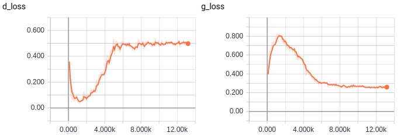
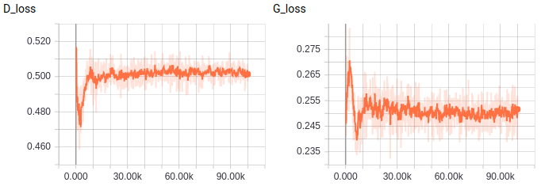
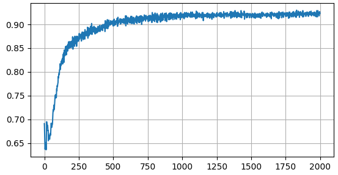

# Code for the paper [Adversarial Feature Augmentation for Unsupervised Domain Adaptation](https://arxiv.org/abs/1711.08561)

[CVPR2018](http://openaccess.thecvf.com/content_cvpr_2018/html/Volpi_Adversarial_Feature_Augmentation_CVPR_2018_paper.html)

**Step 0**: training a classifier on source data.

**Step 1**: training a feature generator to perform feature augmentation in the source feature space.

**Step 2**: training an encoder by adapting it to the source features.

## Overview

### Files

``model.py``: contains the models described in the paper, implemented in Tensorflow (slim)

``train_op.py``: contains the operations to perform Step 0, Step 1 and Step 2.

### Prerequisites

Python 2.7, Tensorflow 1.3 (PyTorch version coming soon(ish))

## How it works

To obtain MNIST and SVHN dataset, run

```
python download_and_process_mnist.py
sh download_svhn.sh
```

To train a ConvNet feature extractor using SVHN data, run

```
python main.py --mode=train_feature_extractor
```

To train a generator of features that resemble the ones extracted through the pre-trained feature extractor, run

```
python main.py --mode=train_feature_generator
```
The resulting model (feature_generator) can be used to generate new features from the desired classes, by feeding it with noise vectors concatenated with one-hot label codes. To adapt the feature extractor trained on SVHN to MNIST data, run

```
python main.py --mode=train_DIFA
```
Default GPU index is 0. To use a different GPU, add --gpu=GPU_IDX when launching. 

## What to expect

In all our experiments, carried out on six different datasets, we could observe the same pattern while training the *feature generator*: the discriminator wins the minimax game for the first few thousand iterations, then the loss associated to the generator starts to decrease. In every experiment we ran, the minimax game converged to a very stable equilibrium, with the discriminator giving as outputs numbers very close to 0.5, independently by the inputs given (real/generated features).

 

*Discriminator and generator losses for Step 1*

 

*Discriminator and encoder losses for Step 2*

 

*MNIST target accuracy for Step 2 (iterations x50)*


## Reference

**Adversarial Feature Augmentation for Unsupervised Domain Adaptation**  
Riccardo Volpi, Pietro Morerio, Silvio Savarese and Vittorio Murino *[PDF](https://arxiv.org/abs/1711.08561)* 
```
    @InProceedings{Volpi_2018_CVPR,
    author = {Volpi, Riccardo and Morerio, Pietro and Savarese, Silvio and Murino, Vittorio},
    title = {Adversarial Feature Augmentation for Unsupervised Domain Adaptation},
    booktitle = {The IEEE Conference on Computer Vision and Pattern Recognition (CVPR)},
    month = {June},
    year = {2018}
    }
```
